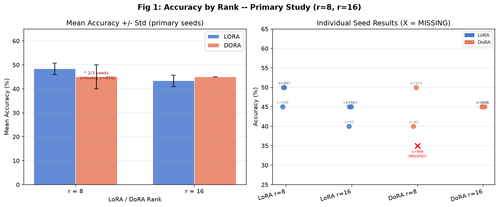

<div align="center">
  
# LoRA vs DoRA: An Empirical Study on Gemma 4 E4B-IT

[](#data-provenance)
[](https://huggingface.co/google/gemma-4-E4B-it)
[](https://huggingface.co/datasets/openai/gsm8k)
[](https://huggingface.co/docs/peft)

**A rigorous pilot study investigating the relative effectiveness and efficiency of Low-Rank Adaptation (LoRA) vs. Weight-Decomposed Low-Rank Adaptation (DoRA) on mathematical reasoning tasks.**

</div>

---

## 📖 Executive Summary

This repository contains the complete experimental pipeline, codebase, and provenance tracking for a rigorous pilot study comparing LoRA and DoRA. We fine-tuned the 4-bit quantized **Gemma 4 E4B-IT** model on the **GSM8K** mathematical reasoning dataset. 

The objective was to determine how adaptation rank ($r$) affects the accuracy and computational efficiency of both methods. Rather than claiming definitive universal results from a small-scale pilot, this repository demonstrates **research-grade experimental design, strict data provenance tracking, and reproducible evaluation pipelines.**

---

## 🧪 Experimental Design

| Parameter | Configuration |
| :--- | :--- |
| **Model** | `google/gemma-4-E4B-it` (Mixture-of-Experts, 4-bit NF4 quantized) |
| **Dataset** | `openai/gsm8k` (`main` config, 200 train examples, 20 eval examples) |
| **Primary Methods** | LoRA, DoRA |
| **Primary Ranks ($r$)** | $8$, $16$ |
| **Random Seeds** | $42$, $123$, $456$ |
| **Total Primary Configurations** | 12 (Method × Rank × Seed) |
| **Metric** | Exact-match accuracy on the final numeric answer |

---

## 📊 Primary Results

The table below presents the verified outcomes of the primary 12-configuration study. 

| Method | Rank ($r$) | Seed | Accuracy | Status |
| :---: | :---: | :---: | :---: | :--- |
| **LoRA** | 8 | 42 | **50%** | `LOG_VERIFIED` |
| **LoRA** | 8 | 123 | **50%** | `LOG_VERIFIED` |
| **LoRA** | 8 | 456 | **45%** | `LOG_VERIFIED` |
| **LoRA** | 16 | 42 | **40%** | `LOG_VERIFIED` |
| **LoRA** | 16 | 123 | **45%** | `LOG_VERIFIED` |
| **LoRA** | 16 | 456 | **45%** | `LOG_VERIFIED` |
| **DoRA** | 8 | 42 | **40%** | `LOG_VERIFIED` |
| **DoRA** | 8 | 123 | **50%** | `LOG_VERIFIED` |
| **DoRA** | 8 | 456 | *Missing* | `MISSING` *(Pending GPU Quota)* |
| **DoRA** | 16 | 42 | **45%** | `LOG_VERIFIED` |
| **DoRA** | 16 | 123 | **45%** | `LOG_VERIFIED` |
| **DoRA** | 16 | 456 | **45%** | `LOG_VERIFIED` |

> ⚠️ **Note:** The final configuration (`DoRA, r=8, seed=456`) is currently pending due to GPU quota constraints. Once executed and validated, an automated ingestion script (`scripts/ingest_dora_r8_s456.py`) will ingest the artifact, verify integrity, update this dataset, and regenerate all visual figures.

### Visual Analysis

*Visualizations are generated automatically via `scripts/build_portfolio.py`.*

<div align="center">
  
  <br>
  <em>Figure 1: Mean Accuracy by Rank and Method (left) and Individual Seed Distributions (right).</em>
</div>

---

## 🔬 Methodology

### Adapter Configuration
Adapters were applied to all 66 dynamically discovered `q_proj` and `v_proj` modules within the model's `language_model` branch.
- **LoRA Alpha:** 16
- **Dropout:** 0.05
- **Task Type:** `CAUSAL_LM`

### Training Procedure
Models were trained for 20 steps (effective batch size 8) using the `SFTTrainer`. We employed **completion-only masking**, where prompt tokens were masked with `label=-100` to calculate loss strictly on the model's generated reasoning and answer.

### Evaluation Protocol
Because Gemma 4 E4B-IT is a "thinking-capable" model, generating traces `<thought>...</thought>` prior to the final answer, we strictly enforced `enable_thinking=False` via the processor's chat template during evaluation. Predictions were split using the `####` GSM8K delimiter, and the final numeric string was extracted using regular expressions for exact-match accuracy against the gold standard.

---

## 🛡️ Data Provenance & Integrity

A cornerstone of this repository is absolute transparency regarding experimental outcomes. Not every experiment succeeded; failures, anomalies, and missing data are documented explicitly rather than being fabricated, interpolated, or silently discarded.

| Category | Count | Details |
|----------|-------|---------|
| **Primary `LOG_VERIFIED`** | 11/12 | Recovered from original Kaggle sweep logs, cross-checked. |
| **Primary `MISSING`** | 1/12 | DoRA r=8 seed=456 — GPU quota exhausted; pending validated rerun. |
| **Supplementary `LOG_VERIFIED`** | 7 | r=4 and r=32 partial sweep, confirmed from logs. |
| **`PROVISIONAL_PENDING_AUDIT`** | 2 | DoRA r=4 seed=123, r=4 seed=456 — anomalous 5% result; evaluator issue suspected but not yet formally confirmed by audit. |
| **`INCOMPLETE_UNAVAILABLE`** | 2 | DoRA r=32 seed=123, r=32 seed=456 — runs did not complete; exact failure mode not confirmed. |
| **`TRAINING_COMPLETE_EVAL_INCOMPLETE`** | 1 | LoRA r=32 seed=456 — training confirmed complete (adapter saved, runtime=1243s); evaluation phase incomplete; no final accuracy assigned. |

> All results are traceable to a `status` and `provenance` column in every CSV located in `results/processed/`. Provisional and incomplete results are **never** included in primary statistics. The audit process for provisional results is documented in [`docs/evaluator_audit_report.md`](docs/evaluator_audit_report.md).

---

## 🗂️ Repository Structure

```text
gemma-lora-dora-gsm8k/
├── README.md                           # You are here
├── requirements.txt                    # Pinned dependencies for reproducibility
├── configs/                            # YAML configurations for sweeps and runs
├── src/                                # Core logic (adapters, model loading, eval, train)
├── scripts/                            # Executable scripts (training, portfolio building, audits)
├── docs/                               # Methodology, limitations, metadata, and audit reports
└── results/
    ├── processed/                      # Final tabular data with strict provenance (CSVs)
    └── figures/                        # Matplotlib visualizations generated from processed data
```

---

## ⚠️ Limitations
- **Evaluation Variance:** The evaluation set comprises only 20 examples, meaning each correct answer swings the accuracy by 5%. 
- **Pilot Scale:** Models were trained for 20 steps, which establishes initial learning trajectories but does not represent full convergence.
- **Resource Constraints:** 15GB T4 GPU VRAM limits prevented the full successful execution of DoRA at rank $r=32$.

For a comprehensive breakdown of known limitations, see [`docs/limitations.md`](docs/limitations.md).

---

## 🚀 Reproducibility

To regenerate the portfolio artifacts (figures and full CSV aggregations) from the verified raw data:

```bash
pip install -r requirements.txt
python scripts/build_portfolio.py
```

### Ingesting the Final Pending Result
Once the final `DoRA r=8 seed=456` run completes on Kaggle, the repository is configured to ingest it safely without manual CSV editing:
```bash
python scripts/ingest_dora_r8_s456.py --artifact <path_to_downloaded_artifact_directory>
```
*This script updates the primary results, runs a 13-point consistency check, regenerates all figures, and writes a cryptographic `reproducibility_manifest.json`.*
